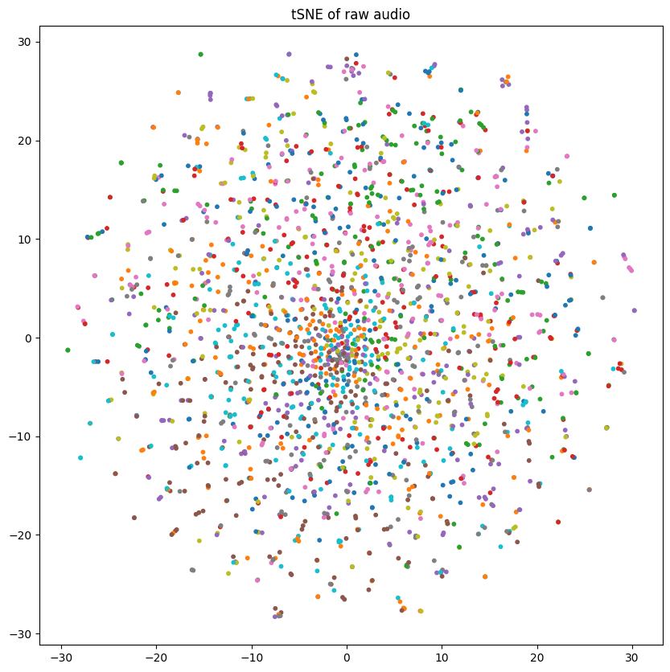
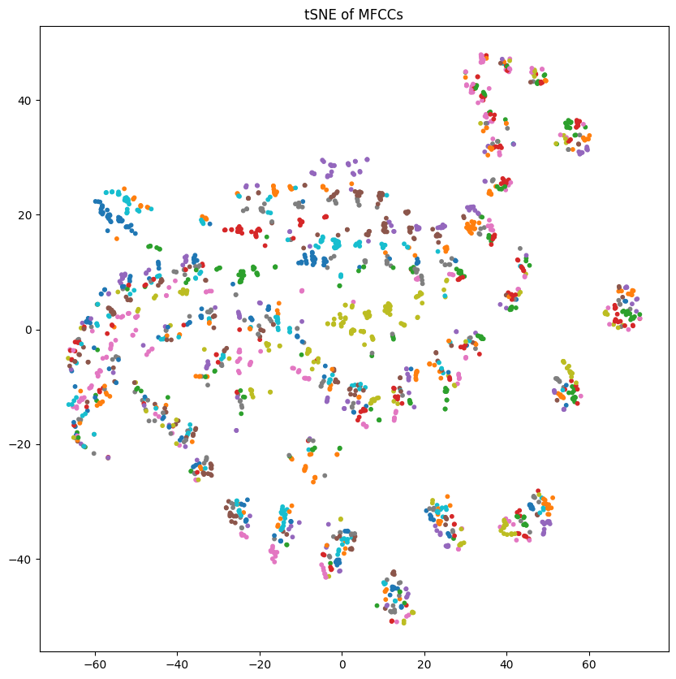
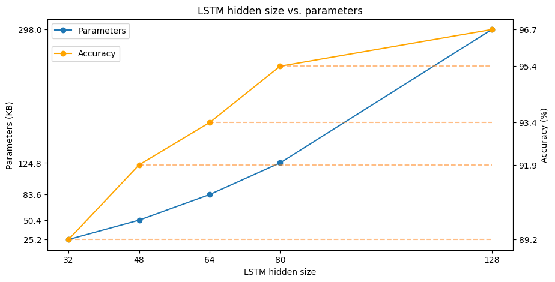

## Training a recurrent neural network (RNN) to categorize audio clips for spoken digits

### Data

The [free spoken digits](https://github.com/Jakobovski/free-spoken-digit-dataset) dataset consists of 3000 recordings of 6 participants speaking the numbers 0 to 9 in English; the set is comprised of .wav audio files.

I used a [proxy](https://github.com/eonu/torch-fsdd/) for this dataset which creates a *PyTorch* `Dataset` object from the recordings. While this was an invaluable bootstrap for the task, I ended [modifying](https://github.com/chanokin/torch-fsdd/) it due to version incompatibilities.

#### Preprocessing

As I had not worked with audio data directly, I searched the internet for prior work on this subject. The main takeaways were:

 1. A spectrogram is not the best transform for voice.
 2. The Mel-Frequency Cepstral Coefficients (MFCC) describes the "envelope" of the spectrum in a compact way and is preferred in speech recognition.
 3. A way to add noise to the input is to occlude an MFCC "channel" throughout the sample or drop a frame (time step) over all channels.

I split the data in train, validation and test subsets with a 70%, 15%, 15% proportion. All samples were transformed by trimming silences and the MFCC transform from the `torchaudio`library. Additionally, for the training data I added noisy via channel/step dropping; this was done with the purpose of enhancing the robustness of the network.

After selecting these transforms (except for the noise) I did some exploration of the data. The tSNE of the raw audio training samples seems pretty hard to disentangle, while the same reduction for the MFCC representation seems to be locally clustered which should help in the training stage.
Raw audio | MFCC
:-------: | :--:
 | 

### Network architecture

Throughout the work I used *PyTorch* for modelling and *Pytorch-Lightning* for training. The network is composed of:

* 1 `LSTM` layer, and
* 1 `Linear` layer.

I chose an `LSTM` layer because it is recurrent, which satisfies the requirement of the task, and has been used in many time series problems in literature. Furthermore, the recurrence provides the layer a "memory" of past events (frames of the MFCC) which is used to produce an embedding which represents the sequence. The `Linear` layer maps the embedding to the class via an all-to-all connection.

### Classification

The baseline network has an `LSTM` with 128 hidden units; this results in an average of 97% test accuracy.

#### Smaller sizes

After this, I started to reduce the LSTM layer size, I found that a size around 64 it starts to drop performance. However, the drop is not too bad, even at 48 hidden neurons the network is above 90% accuracy.

Due to the parameters still being 32-bit floating point, at 32 hidden neurons and 89% accuracy, we have a network size of 25.2 KB.

#### Pruning

Another method of network size reduction is to prune "unused" connections (i.e. whose value is near or equal to zero). For this I used Lightning's own pruning capabilities which allow to remove connections at different rates for different stages of training. I performed a 50% pruning at epoch 10, 25% at epoch 20 and a 1% from epochs 30 to 50. This resulted in a reduction of around 69% of parameters while maintaining a 94% accuracy. The size of the parameters went from 100.7KB to 31.2KB.

Note that this required trial and error (which could be automated) to reach the desired performance with a network size under the 36KB limit the task required. As a side note, I had to modify the source for Lightning due to non-default parameter names in *PyTorch*'s `LSTM` layer.

#### Quantization

This method changes the parameter data type to a smaller one (e.g. from 32-bit floats to 8-bit integers) while keeping sufficient range and precision to represent the weights distribution.

##### Post-training Quantization (PTQ)

I tried `PyTorch`'s native dynamic PTQ, this only converts the weights from float32 to int8. For a network, with 80 hidden neurons in the 'LSTM' layer, I did not notice too big a loss in accuracy, which was about a 1% drop.

#### Quantization-aware training (QAT)

To quantize into a powers-of-two weight range I had to use QAT, in this method the quantization is simulated while the network is training. The main idea is that the training would push the weights' values into the appropriate bins so they are more effective in the overall network behavior.

I tried to use `PyTorch`'s native framework with custom [observers](https://github.com/AdamDHines/VPRTempo-quant/blob/7e19f4fa60234d889ff3fe0991cb3d792f20ce26/VPRTempoQuant_Train.py#L223) but this resulted in extremely poor performance (chance accuracy).

Fortunatelly, there are libraries that do this particular quantization; in particular, I used [Brevitas](https://xilinx.github.io/brevitas/) by Xilinx. I changed the building blocks (`LSTM`, `Linear`, and `ReLU`) for their "quantizable" counterparts (`QuantLSTM`, `QuantLinear`, and `QuantReLU`) and did the training and testing as usual. With this method, I found that the performance dropped to about 66% of testing accuracy.

### Conclusions

Reducing the memory footprint of a neural network is crucial for real-time execution of these models. The two most common ways are to: prune (useless) and/or quantize connections. The former reduces the number of weights, however, it requires some connectivity information which could lead to little gains in terms of footprint reduction. The latter discretizes the weights values and (sometimes) activation functions.
The following table summarizes the different size reduction experiments.

|           | Baseline | Small | Small 80 | Pruned |  PTQ  | QAT Po2 |
| :-------- | :------: | :---: | :------: | :----: | :---: | :-----: |
| LSTM Size |   128    |  32   |    80    |   72   |   80  |    80   |
| Size (KB) |  297.6   | 25.2  |   124.8  |  31.2  |  30.5 |   30.2  |
| Accuracy  |    97    |  89   |    95    |   94   |   93  |    66   |

Prunning resulted in 65% reduction of parameters while almost no performance was dropped. I was surprised to see such little accuracy drop there was from post-training quantization. I was further surprised of how much performance the network lost by in the QAT + Po2  regime; I think that, to improve accuracy, I could transfer the weights from a pre-trained network (with float parameters) and then fine tune it using QAT. I thought about normalizing the samples so that each has mean zero and unit variance; however, the performance of the network was suffiently good so I didn't try it.

### Repository contents:
* `sdc` - Python sources:
   * `rnn` Base pytorch network
   * `rnn_brevitas` Quantizable network via brevitas
   * `trainer` Lightning wrapper to make training easier
* `notebooks` - Experiments on size reduction:
   * `explore_data` Check how to use the dataset and its properties
   * `training_base` Use LSTM with 128 hidden neurons
   * `training_small` Use LSTM with different numbers of hidden neurons
   * `training_prune` Find the smalles pruned network that fits the 35KB constraint
   * `training_ptq` Post-training quantization (LSTM 80 neurons)
   * `training_po2_qat` Quantization aware training for power-of-two parameters (native, LSTM 80 neurons)
   * `training_po2_qat_brevitas` Quantization aware training for power-of-two parameters (brevitas, LSTM 80 neurons)
